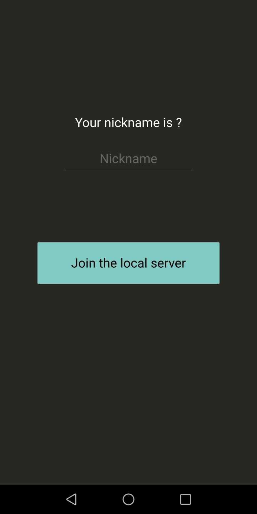
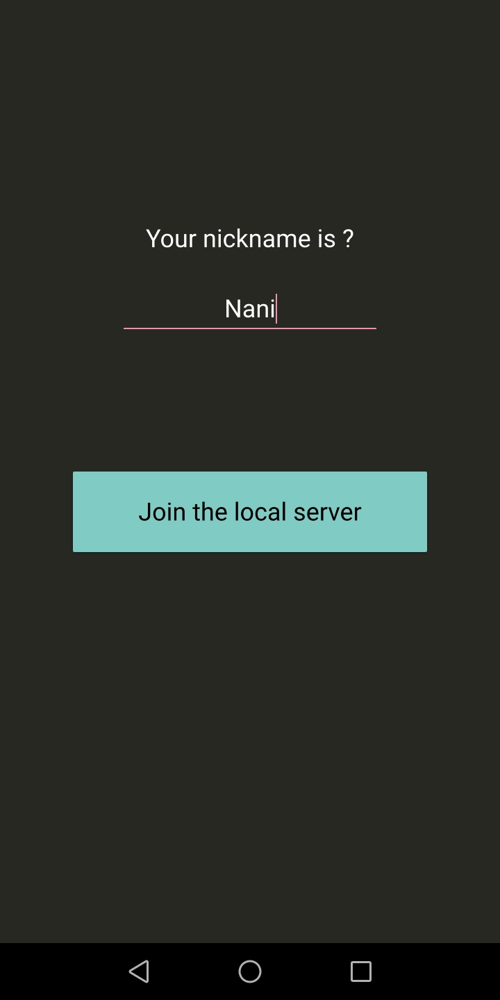
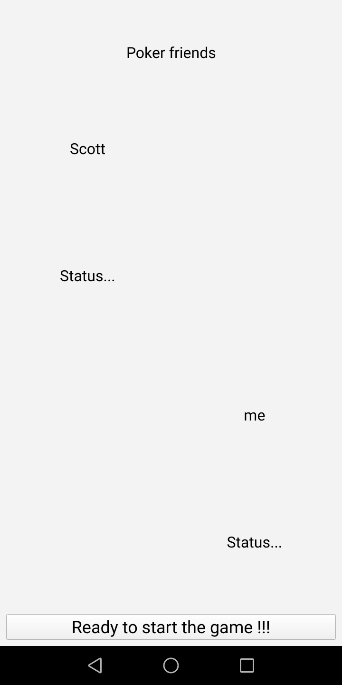

# Pokerfriends 

Why would you need any cards and poker chips to player Poker with your friends ?

> Pokerfriends is a multiplayer pokergame, and it is really simple to use.

* Pokerfriends works serverless, you just need to be connected to the same wifi of  your friends.

* Pokerfriends is free, no adds, and opensource.

* Pokerfriends has a nice material style and a default eye painless Dark Theme.

> Here are some preview of the project

The login page

  

  

And the game "lobby"

  

That's it for the moment, NEXT in the list is a 3D animation of the poker table with the players around.